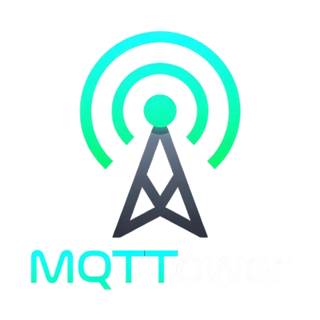

<p align="center">
  
</p>

<p align="center">
  <strong>A web dashboard for managing one or more Mosquitto MQTT brokers from a single interface.</strong>
</p>

<p align="center">
  <a href="https://github.com/FinalFactory/MQTTower/releases/latest"></a>
  <a href="LICENSE"></a>
  
</p>

---

> **Early development** — APIs, configuration, and database schema may change between releases.

## What is MQTTower?

MQTTower gives you a browser-based control panel for your Mosquitto brokers. It handles broker configuration, client/user management (Mosquitto Dynamic Security), device tracking, scheduled actions, metric collection, and alerting — across multiple brokers if you need it. Designed for homelabs and small deployments where you want visibility into your MQTT infrastructure without stitching together CLI tools.

The system has two components:

- **Dashboard** (MQTTower.Web) — Blazor Server app. Manages broker profiles, devices, schedulers, watchers, and notifications. Connects to brokers through their agents.
- **Agent** (MQTTower.Agent) — Lightweight sidecar that runs on the same machine as Mosquitto. Manages the local `mosquitto.conf`, reloads the broker, and exposes a REST API for the dashboard.

## Features

- **Multi-broker management** — Add and switch between multiple Mosquitto instances from one dashboard.
- **Dynamic Security (DynSec)** — Create, edit, and delete MQTT clients, groups, and roles through the UI.
- **Device tracking** — See connected devices, their state, and last activity.
- **Schedulers** — Cron-based scheduled MQTT publishes (e.g. turn off lights at midnight).
- **Watchers** — Rules that trigger on topic patterns (e.g. alert when temperature exceeds a threshold).
- **Notifications** — Send alerts via ntfy, webhook, or SMTP when watchers fire.
- **Metrics & charts** — Broker stats over time (connected clients, messages, bytes).
- **Audit log** — Track who changed what, when.
- **Secure agent enrollment** — Shared secret or one-time tokens for agent registration.
- **Live logs & topic explorer** — Stream broker logs and inspect topic trees in real time.
- **mTLS** — Optional mutual TLS between dashboard and agents.

## Screenshots

<!-- TODO: Add screenshots of the dashboard UI -->

## Install

### Proxmox LXC

On a **Proxmox VE** host, run:

```bash
bash -c "$(curl -fsSL https://raw.githubusercontent.com/FinalFactory/MQTTower/main/deploy/ct/mqttower.sh)"
```

The installer asks which mode you want:

| Mode | What it installs |
|---|---|
| **Full stack** | Mosquitto + Agent + Dashboard in one LXC |
| **Broker** | Mosquitto + Agent (point at an existing dashboard) |
| **Dashboard** | MQTTower.Web only (connect to remote broker agents) |

Each mode creates a Debian LXC, installs dependencies, and sets up systemd services.

To **update** an existing container:

```bash
bash -c "$(curl -fsSL https://raw.githubusercontent.com/FinalFactory/MQTTower/main/deploy/ct/mqttower.sh)" update <CTID>
```

Or run `/usr/bin/update` inside the LXC.

### Docker

```bash
cd docker/
docker compose up -d
```

Starts the dashboard on **port 8080** and a broker container (Mosquitto + Agent) on **MQTT 1883** / **Agent HTTP 5080**. Edit `.env` or the `environment` block in `docker-compose.yml` to change credentials and ports.

### From source

Requires [.NET 9 SDK](https://dotnet.microsoft.com/download/dotnet/9.0).

```bash
# Dashboard
dotnet run --project src/MQTTower.Web

# Agent (run on the same machine as Mosquitto)
dotnet run --project src/MQTTower.Agent
```

## Configuration

### Dashboard

| Variable | Description | Default |
|---|---|---|
| `MQTTOWER_ADMIN_USER` | Initial admin username | `admin` |
| `MQTTOWER_ADMIN_PASS` | Initial admin password | *(generated on LXC install)* |
| `ConnectionStrings__Default` | SQLite connection string | `Data Source=mqttower.db` |
| `MQTTower__LocalAgentUrl` | Co-located agent URL (full-stack / Docker) | — |
| `MQTTower__LocalAgentApiKey` | API key for that agent (matches `Agent__ApiKey`) | — |
| `MQTTower__WatcherNotifySecret` | Shared secret for watcher notifications from agents | — |
| `MQTTower__RegistrationSecret` | Shared secret for agent registration | *(empty — only one-time tokens accepted)* |
| `ASPNETCORE_URLS` | Listen address | `http://+:8080` |

### Agent

| Variable | Description | Default |
|---|---|---|
| `Agent__ApiKey` | API key for dashboard-to-agent auth | *(required)* |
| `Agent__DashboardUrl` | Dashboard base URL for auto-registration | — |
| `Agent__RegistrationToken` | Registration secret or one-time token | — |
| `Agent__HttpPort` | Agent HTTP listen port | `5080` |
| `Agent__WatcherNotifySecret` | Shared secret for watcher callbacks (must match dashboard) | — |
| `MQTTower__MosquittoConfigPath` | Path to `mosquitto.conf` | `/etc/mosquitto/mosquitto.conf` |
| `MQTTower__MosquittoLogPath` | Path to Mosquitto log file | `/var/log/mosquitto/mosquitto.log` |
| `MQTTower__BrokerUsername` | MQTT login (DynSec admin user) | — |
| `MQTTower__BrokerPassword` | MQTT password | — |

### mTLS (optional)

For mutual TLS between dashboard and agent:

- **Dashboard**: set `MQTTower__AgentClientCertPath` (+ optional `MQTTower__AgentClientCertPassword`) and `MQTTower__AgentTlsServerCaCertPath`.
- **Agent**: set `Agent__RequireClientCertificate=true`, `Agent__TlsCaCertPath` to the CA that signed the dashboard cert, and enable HTTPS (`Agent__HttpsPort`).

## Contributing

Pull requests are welcome on this repository.

### Dev setup

Open `MQTTower.sln` (or `MultiBroker.Debug.slnf` for a lighter load) in Visual Studio or Rider.

**Dashboard** — launch profile `multi-broker-debug` in `Properties/launchSettings.json`.

**Agent** — launch profiles `http-agent-a` (port 5080) and `http-agent-b` (port 5081). Each connects to Mosquitto on `127.0.0.1` using the port from its configured `mosquitto.conf`.

**Docker multi-broker** — `docker compose --profile multi-broker up -d` in `docker/` starts a second broker on MQTT 1884 / Agent 5081.

After starting, approve pending brokers under **Brokers** in the dashboard.

### Running tests

```bash
dotnet test
```

## License

[MIT](LICENSE)
